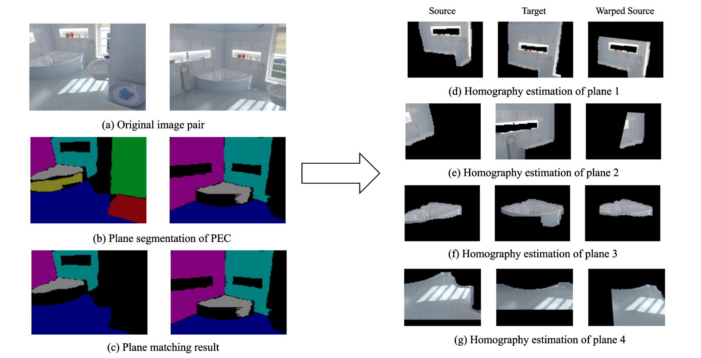

# Relative Pose Estimation from Plane Correspondences

This is part of the code for my semester project at ETH Zurich. The goal of this project is to estimate the relative pose between two cameras from a set of plane correspondences. 




## Dependencies
Please install the latest version of Pytorch, OpenCv, and Kornia

## Model Weights
The trained model for each stage can be downloaded from [here](https://drive.google.com/drive/folders/1iVoUJGaS1G5IWKXZxCsw1bs_1PEuSRCf?usp=share_link)

## Run the Pipeline
First download the model weights and change the path in `raftba.py`
then run the following command
```
python raftba.py
```
